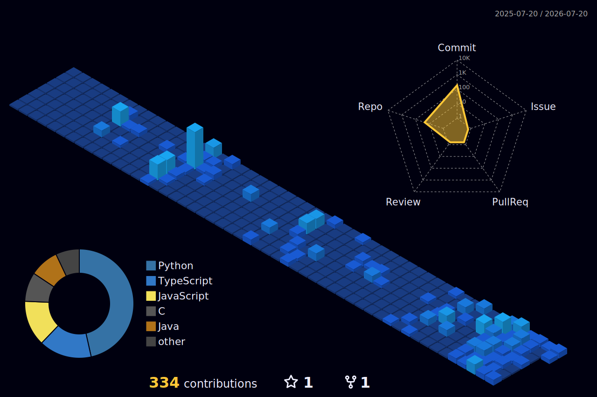

  

  <picture>
    <source media="(prefers-color-scheme: dark)" srcset="./dist/github-snake-dark.svg" />
    <source media="(prefers-color-scheme: light)" srcset="./dist/github-snake.svg" />
    
  </picture>

